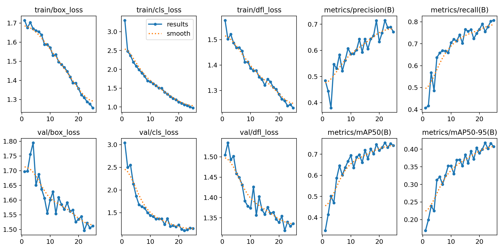
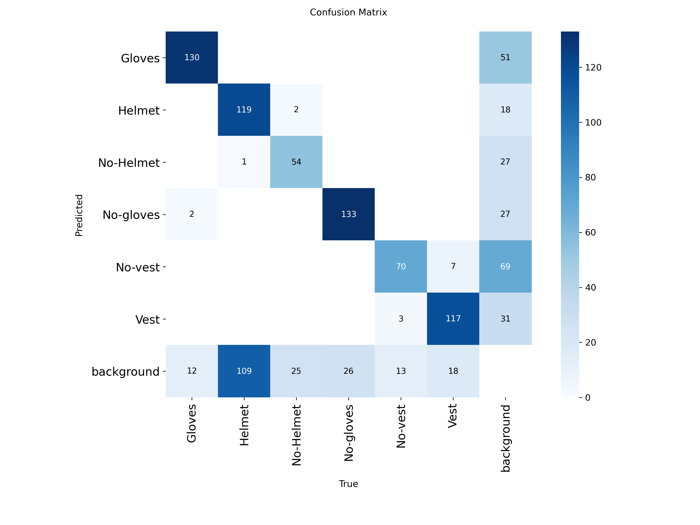
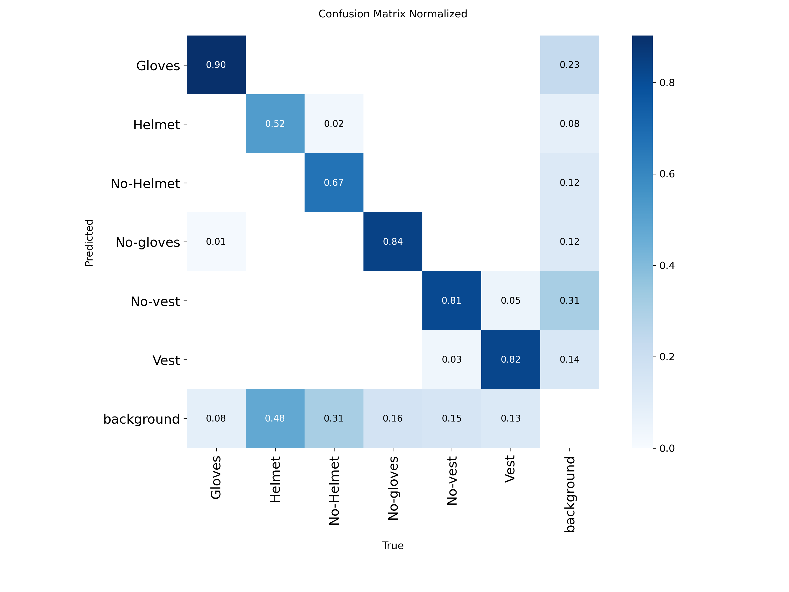

# Personal Protective Equipment Detection

This project is a computer vision application for detecting personal protective equipment in workplace images using YOLOv8.

The model detects safety-related classes such as helmets, vests, gloves, and missing equipment conditions.

## Project Purpose

The aim of this project is to support workplace safety by detecting whether workers are wearing required personal protective equipment in industrial or construction environments.

This project was developed as an educational and portfolio project to demonstrate object detection, model training, evaluation, and inference using YOLOv8.

## Detected Classes

The model was trained to detect the following classes:

* Gloves
* Helmet
* No-Helmet
* No-gloves
* No-vest
* Vest

## Dataset and Credits

The dataset used in this project was downloaded from Roboflow Universe.

**Dataset:** Personal Protective Equipment
**Platform:** Roboflow Universe
**Format:** YOLOv8
**License:** CC BY 4.0

The original dataset is not included in this repository. The dataset was used only for model training and evaluation.

This repository includes:

* Project source code
* Trained YOLOv8 model weights
* Training result graphs
* Confusion matrix outputs
* Custom prediction examples

According to the CC BY 4.0 license, appropriate credit is given to the dataset source. Any model training, evaluation, and prediction outputs in this repository were created as part of this educational project.

## Custom Prediction Examples

Additional AI-generated workplace images were used only for inference testing and visual demonstration.

These custom images were not added to the training, validation, or test dataset. They were used only to show how the trained model performs on new images.

## Technologies Used

* Python
* YOLOv8
* Ultralytics
* OpenCV
* Roboflow
* Google Colab

## Model Performance

Final validation results:

| Metric    | Value |
| --------- | ----: |
| Precision | 0.715 |
| Recall    | 0.755 |
| mAP50     | 0.754 |
| mAP50-95  | 0.418 |

The model performs better on helmet and vest detection. Glove detection is less stable because gloves are small objects and may appear partially occluded.

## Results

Training results and evaluation outputs are available in the `results/` folder.

### Training Results



### Confusion Matrix



### Normalized Confusion Matrix



## Sample Predictions

Example prediction outputs are available in:

```text
results/custom_prediction_examples/
```

Sample prediction images show how the trained model detects personal protective equipment on new workplace images.

Example classes detected in custom images:

* Helmet
* Vest
* No-Helmet
* No-vest
* Gloves
* No-gloves

## Project Structure

```text
personal-protective-equipment-detection/
│
├── README.md
├── requirements.txt
├── train.py
├── predict.py
│
├── weights/
│   └── best.pt
│
├── results/
│   ├── training_results.png
│   ├── confusion_matrix.png
│   ├── confusion_matrix_normalized.png
│   └── custom_prediction_examples/
│       ├── sample_prediction_1.jpg
│       ├── sample_prediction_2.jpg
│       └── sample_prediction_3.jpg
│
└── dataset/
    └── README.md
```

## Installation

Install the required packages:

```bash
pip install -r requirements.txt
```

## How to Run Prediction

Put test images into a folder named:

```text
sample_images/
```

Then run:

```bash
python predict.py
```

The predicted images will be saved automatically by YOLO in the `runs/detect/` folder.

## How to Train the Model

To train the model again, download the dataset from Roboflow Universe in YOLOv8 format.

Then update the dataset path in `train.py`:

```python
DATASET_YAML_PATH = "dataset/data.yaml"
```

Run:

```bash
python train.py
```

## Notes

This is an educational computer vision project.

The trained model is included in the `weights/` folder as:

```text
weights/best.pt
```

The full dataset is not included in this repository because of file size and dataset source considerations.

## Author

Pelin Kaynarpınar
